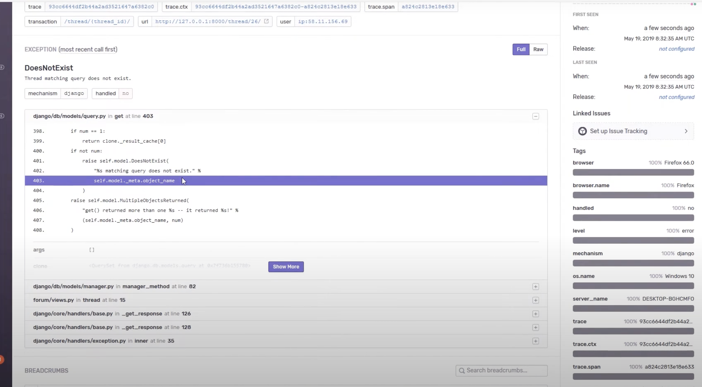

# Available Self-Hosted APM Tool Analysis

---

## **Sentry**

**Pros:**

* Issue-centric views and dashboards — makes it easy for developers to investigate the root cause of errors.
* Exact code snippet that caused the error.
* Can be integrated into Grafana via link-outs to detailed error views.
  [Sentry Grafana Integration](https://sentry.io/integrations/grafana/)
* Active development of both SDKs and self-hosted deployment:

  * [Self-hosted repo (UI, processing)](https://github.com/getsentry/self-hosted)
  * [Python SDK](https://github.com/getsentry/sentry-python)

**Cons:**

* Not aligned with CNCF's OpenTelemetry vision for the future of instrumentation, but still open-source and well-maintained — not a major concern.

**License:** [Functional Source License (FSL)](https://www.tldrlegal.com/license/functional-source-license-fsl)

---

## **Elastic APM**

**Pros:**

* Established and popular observability platform.
* Supports error stacktrace visualization.

**Cons:**

* Questionable licensing — some features may require a commercial license.
* More complex to deploy and manage in self-hosted environments.
* Lower adoption of its APM components compared to general Elastic stack usage.

**License:** Mix of [Elastic License 2.0](https://www.elastic.co/licensing/elastic-license) and [Apache 2.0](https://www.apache.org/licenses/LICENSE-2.0)

---

## **SigNoz**

**Pros:**

* Fully open-source observability platform.
* Visualizes error stacktraces.
* Built around OpenTelemetry.

**Cons:**

* Requires OpenTelemetry instrumentation, which can be more involved compared to native SDKs like Sentry.
* Still a growing project — smaller community and adoption than Sentry.

**License:** [MIT License](https://opensource.org/licenses/MIT)

---

## **Grafana + OpenTelemetry + Custom Panels**

**Pros:**

* Grafana is already in use within the company.
* Flexible and highly customizable dashboards.

**Cons:**

* Achieving the same level of error visibility as Sentry (e.g., code context, user info, breadcrumbs) requires significant custom implementation.
* OpenTelemetry instrumentation adds complexity and learning curve.

**License:** Combination of open-source licenses depending on the stack (Grafana: AGPLv3, OTEL: Apache 2.0, etc.)

---

Would you like this comparison added as a downloadable PDF or included in your internal documentation?

| Feature / Tool            | Sentry (Self-hosted)                  | Elastic APM                       | SigNoz (OTEL)          | OTEL + Grafana     |
|---------------------------|----------------------------------------|-----------------------------------|--------------------------------------|----------------------------------------|
| Supported Languages       | Python, Rust (official SDKs)          | Python only  (SDK)                      | Python, Rust              | Python, Rust                |
| Error Code context      | yes, part of code included         | no, only codeline | no, only codeline             | no, only codeline    |
| Instrumentation Complexity          | Easy, SDK   | Easy-Medium, SDK | Medium-Hard, OTEL instrumentation | Medium-Hard, OTEL instrumentation |
| Licensing                 | Functional Source License (if non-compete, then free for use)              | Elastic license v2 (some parts paid) | MIT     | mix of open-source licenses                      |

From my perspective, Sentry is the tool that suits us best:
Best observability for developers - all error/exception related information in one place with code instantly available.
No need to create custom visualisations - all should work from the box.
Ease of instrumentation. No overhead with OTEL.
Widely used, big community. 
Quite comfortable license, which will in 2 years switch to Apache 2.0.

If Sentry is approved - next step is POC to prove it works as intended with our language/framework of choice. 
If everything fits our needs - then documentation and implementation.
