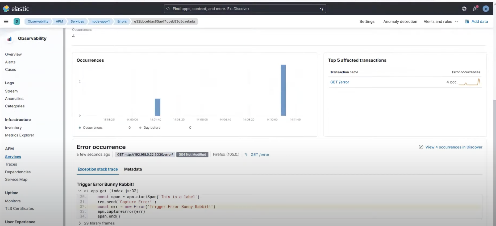

# Available Self-Hosted APM Tool Analysis

## **Sentry**

**Pros:**

* Issue-centric views and dashboards — makes it easy for developers to investigate the root cause of errors.
* Exact code snippet that caused the error.
* Can be integrated into Grafana via link-outs to detailed error views.
  [Sentry Grafana Integration](https://sentry.io/integrations/grafana/)
* Active development of both SDKs and self-hosted deployment:

  * [Self-hosted repo (UI, processing)](https://github.com/getsentry/self-hosted)
  * [Python SDK](https://github.com/getsentry/sentry-python)

**Cons:**

* Not aligned with CNCF's OpenTelemetry vision for the future of instrumentation, but still open-source and well-maintained

**License:** [Functional Source License (FSL)](https://www.tldrlegal.com/license/functional-source-license-fsl)

## **Elastic APM**

**Pros:**

* Established and popular observability platform.
* Supports error stacktrace visualization.

**Cons:**

* Questionable licensing — some features may require a commercial license.
* More complex to deploy and manage in self-hosted environments.
* Lower adoption of its APM components compared Sentry SDKs/OTEL.
* Not aligned with CNCF's OpenTelemetry vision for the future of instrumentation, but still open-source 

**License:** Mix of [Elastic License 2.0](https://www.elastic.co/licensing/elastic-license) and [Apache 2.0](https://www.apache.org/licenses/LICENSE-2.0)

## **SigNoz**

**Pros:**

* Fully open-source observability platform.
* Visualizes error stacktraces.

**Cons:**

* OpenTelemetry instrumentation adds complexity, compared to native SDKs like Sentry.
* Lesser level of error visibility compared to Sentry
* Smaller community and adoption than Sentry.

**License:** [MIT License](https://opensource.org/licenses/MIT)

## **Grafana + OpenTelemetry + Custom Panels**

**Pros:**

* Grafana is already in use within the company.

**Cons:**

* Achieving the same level of error visibility as Sentry (e.g., code context, user info, breadcrumbs) requires significant custom implementation.
* OpenTelemetry instrumentation adds complexity, compared to native SDKs like Sentry.

**License:** Combination of open-source licenses 

# Conclusions

 **Sentry** looks like the tool that suits us best:
- **Code snippets available in report** - eases detection of error cause
- **Best observability for developers** — all error/exception-related information is centralized, with source code immediately visible.
- **No need for custom visualizations** — everything works out-of-the-box.
- **Ease of instrumentation** — no additional complexity from OpenTelemetry.
- **Widely adopted** with a large and active community.
- **Comfortable license** — currently under the Functional Source License, and set to transition to **Apache 2.0** in two years.

Depending on strategy, we can go with OTEL based solutions, as OTEL is vendor neutral. 
Maybe something like [zero code OTEL](https://opentelemetry.io/docs/zero-code/python/) . 
However it could take more time in general to implement OTEL and get ease of use for developers in UI part.

## Next Steps

- If **Sentry is approved**, the next step is to run a **POC** to ensure it works as intended with our primary languages and frameworks.
- If the POC is successful and the tool meets our needs:
  - Proceed with **internal documentation**
  - Begin **implementation and rollout**

| Feature / Tool            | Sentry (Self-hosted)                  | Elastic APM                       | SigNoz (OTEL)          | OTEL + Grafana     |
|---------------------------|----------------------------------------|-----------------------------------|--------------------------------------|----------------------------------------|
| Supported Languages       | Python, Rust (official SDKs)          | Python only  (SDK)                      | Python, Rust              | Python, Rust                |
| Error Code context      | yes, part of code included         | no, only codeline | no, only codeline             | no, only codeline    |
| Licensing                 | Functional Source License (if non-compete, then free for use)              | Elastic license v2 (some parts paid) | MIT     | mix of open-source licenses                      |
